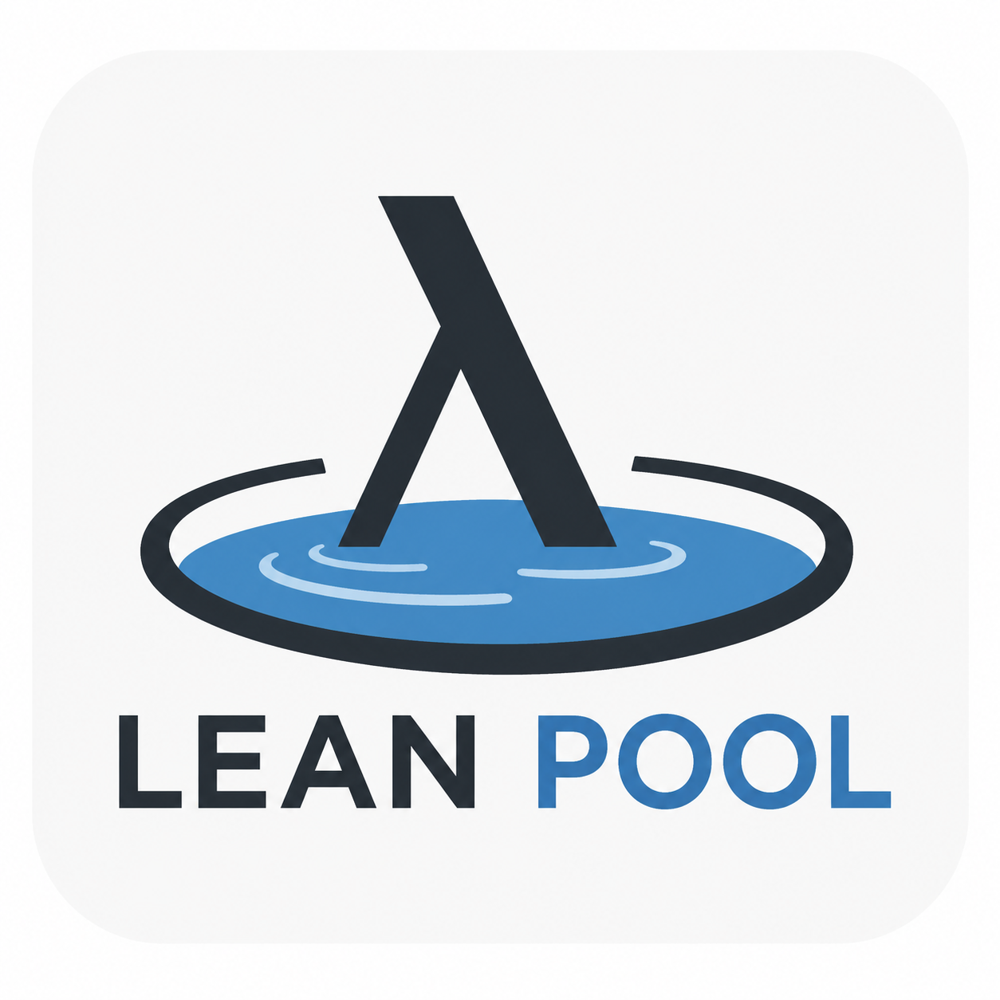

<p align="center">
  
</p>

# lean-pool

[](https://github.com/Vilin97/lean-pool/actions/workflows/lean_action_ci.yml)
[](https://vilin97.github.io/lean-pool/)
[](https://vilin97.github.io/lean-pool/exposition/)
[](LICENSE)
[](https://doi.org/10.5281/zenodo.20513444)

Lean Pool sits between [`mathlib`](https://github.com/leanprover-community/mathlib4) and [`merely-true`](https://github.com/merely-true/merely-true), preserving Lean 4 formalizations that don't fit mathlib's scope. Instead of mathlib's high-bar human review, it relies on deterministic linters and LLM judgment, so it can grow faster while staying `sorry`-free and pinned to the latest Mathlib. See [`MOTIVATION.md`](MOTIVATION.md) for the why, browse the API docs at <https://vilin97.github.io/lean-pool/>, and explore each project's dependency graph and declarations in the [exposition site](https://vilin97.github.io/lean-pool/exposition/).

<!-- BEGIN STATS -->
**147** formalization projects · **1,067,280** lines of Lean · **2** open challenges
<!-- END STATS -->

<sub>(stats above are refreshed automatically by [`readme-stats.yml`](.github/workflows/readme-stats.yml) — edit [`python/lean_pool/stats.py`](python/lean_pool/stats.py), not the numbers)</sub>

So far, projects have been added by hand: each is a suitable, permissively licensed (Apache-2.0 or MIT) Lean repository, bumped to the latest Lean and Mathlib, made to pass [CI](.github/workflows/lean_action_ci.yml) — it builds warning-free and clears Mathlib's linters, the style checker, and the repository quality gates (no `sorry`/`admit`, no axioms beyond `Classical.choice`/`propext`/`Quot.sound`, no `unsafe`/`partial`, file headers, size limits) — and an [LLM review](.github/REVIEW_RULES.md) of fit and significance, then merged.

### Getting started

Requires Lean (via [`elan`](https://leanprover-community.github.io/install/), with the toolchain pinned in [`lean-toolchain`](lean-toolchain)) and Python 3.13+ with [`uv`](https://docs.astral.sh/uv/).

```bash
make setup    # pull Mathlib oleans, build the whole pool (~1.5h), install Python tooling
```

To work on a single project you don't need the whole pool built — see the
[fast per-project build](CONTRIBUTING.md#dev-setup) in `CONTRIBUTING.md`.

### Challenge mode

[`Challenge/`](Challenge/) is the other half of the pool: open *statements* rather than finished proofs. A challenge is a theorem written in Mathlib vocabulary and left as `sorry`, registered in [`Challenge/challenges.yml`](Challenge/challenges.yml) alongside the English statement it is supposed to say. It is the only place `sorry` is allowed, and only for the declarations the registry lists — everything else in the file must be closed, and every other gate still applies.

Anyone can propose one. The [LLM reviewer](.github/CHALLENGE_REVIEW_RULES.md) judges a challenge on different grounds than a project: whether the problem is significant, whether the Lean faithfully says what the prose says, whether a cited known result is stated the way its source states it, whether the statement is vacuous or gameable, and how many lines of Lean a solution would take.

Anyone can answer one, too. A solution lands in [`Solution/`](Solution/), restating the statement and proving it, and [`leanprover/comparator`](https://github.com/leanprover/comparator) settles whether it counts: [CI](.github/workflows/challenge-verify.yml) exports the challenge and solution environments separately, checks that the statements agree, and replays the proof through the Lean kernel with no axiom beyond `propext`/`Quot.sound`/`Classical.choice`. Because a kernel decides correctness, the [solution review](.github/SOLUTION_REVIEW_RULES.md) is short — and is skipped entirely when the PR adds nothing but the answer.

```bash
make challenges              # what's on the board
make verify-challenge C=<slug>  # replay a solution locally
```

See [Challenge mode](CONTRIBUTING.md#challenge-mode) in `CONTRIBUTING.md`.

### Contributing

See [`CONTRIBUTING.md`](CONTRIBUTING.md).

### Credits

Created as part of the [UW Lean Hackathon](https://uw2026leanhackathon.github.io/) by [Vasily Ilin](https://github.com/Vilin97) and [Justin Asher](https://github.com/justincasher).

### Difference from similar projects

[Tau Ceti](https://github.com/TauCetiProject/TauCeti) is another approach to solve the same problem. The differences are:
- Lean Pool accepts human-written projects, not just AI projects.
- Lean Pool is not a unified library like mathlib. Most projects are independent of each other.
- Lean Pool only accepts completed formalization projects.
